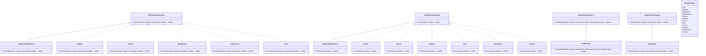

# OOP Calculator

## A calculator built using C#, WinForms
------

``` mermaid
classDiagram
    class IDoubleValueOperation {
        + Execute(firstValue: double, secondValue: double): double
    }
    class ISingleValueOperation {
        + Execute(value: double): double
    }
    class IDoubleValueCompute {
        + ComputeIt(firstValue: double, secondValue: double, operationType: type): double
    }
    class ISingleValueCompute {
        + ComputeIt(value: double, operationType: type): double
    }
    class DoubleValueOperation {
        + Execute(firstValue: double, secondValue: double): double
    }
    class SingleValueOperation {
        + Execute(value: double): double
    }
    class DoubleValue {
        + ComputeIt(firstValue: double, secondValue: double, operationType: OperationType): double
    }
    class SingleValue {
        + ComputeIt(value: double, operationType: OperationType): double
    }
    class Addition {
        + Execute(firstValue: double, secondValue: double): double
    }
    class Division {
        + Execute(firstValue: double, secondValue: double): double
    }
    class Multiplication {
        + Execute(firstValue: double, secondValue: double): double
    }
    class Substraction {
        + Execute(firstValue: double, secondValue: double): double
    }
    class Power {
        + Execute(firstValue: double, secondValue: double): double
    }
    class Cosine {
        + Execute(value: double): double
    }
    class Inverse {
        + Execute(value: double): double
    }
    class Modulus {
        + Execute(value: double): double
    }
    class Sine {
        + Execute(value: double): double
    }
    class SquareRoot {
        + Execute(value: double): double
    }
    class Tangent {
        + Execute(value: double): double
    }
    class OperationType {
        Null,
        Addition,
        Subtraction,
        Multiplication,
        Division,
        Modulus,
        Power,
        Sine,
        Cosine,
        Tangent,
        SquareRoot,
        Inverse
    }

    IDoubleValueOperation <|-- DoubleValueOperation
    ISingleValueOperation <|-- SingleValueOperation
    IDoubleValueOperation <|.. Addition
    IDoubleValueOperation <|.. Division
    IDoubleValueOperation <|.. Multiplication
    IDoubleValueOperation <|.. Substraction
    IDoubleValueOperation <|.. Power
    ISingleValueOperation <|.. Cosine
    ISingleValueOperation <|.. Inverse
    ISingleValueOperation <|.. Modulus
    ISingleValueOperation <|.. Sine
    ISingleValueOperation <|.. SquareRoot
    ISingleValueOperation <|.. Tangent
    IDoubleValueCompute <|-- DoubleValue
    ISingleValueCompute <|-- SingleValue
```
